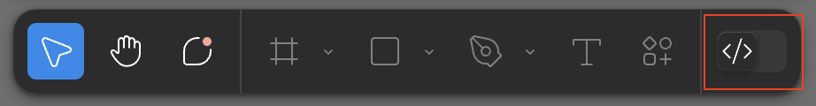

# Добро пожаловать на летнюю практику в FarPost!

Привет!

Мы очень рады видеть тебя в нашей команде этим летом.
Тебя ждет увлекательный и продуктивный опыт, в ходе которого ты сможешь применить свои навыки на реальном проекте и внести значимый вклад в развитие нашего продукта.

## Твоя задача: Разработка прототипа страницы объявлений для UX-тестирования

Наши продакты и дизайнеры активно работают над тем чтобы FarPost стал ещё круче, красивее, функциональнее и, главное, удобнее.

Одно из ключевых направлений — это страницы со списком объявлений.
Ребята хотят её прокачать, но перед тем, как бросаться в бой, им нужно протестировать свои идеи на реальных людях.
А для этого им нужен **рабочий прототип**,
который будет выглядить и ощущаться почти как настоящий сайт. (подробнее про UX тестирование можешь почитать [здесь](https://practicum.yandex.ru/blog/polzovatelskoe-testirovanie-ux/))

**Создание такого прототипа и будет твоей основной задачей на летнюю практику.**
Твоя работа очень важна, так как она позволит собрать фидбек о концепте и разработать наиболее удобный интерфейс,
которым будут пользоваться наши пользователи.

## Требования к разработке

### Используемый стек технологий

Мы не хотим загонять тебя в жесткие рамки, но все-таки есть пара требований, чтобы всем было удобно:

- Обязательно:
  - React (потому что это наш любимая библиотека для фронта)
  - Docker (чтобы было удобно запустить итоговый прототип)
- Остальное — на твой вкус: TypeScript, стейт-менеджеры, компонентные библиотеки...
  Выбирай, что по душе. Если вдруг ступор, мы всегда подскажем!
- Наш топчик (если не знаешь, с чего начать):
  - TypeScript (больше типов богу типов)
  - Zustand + Immer (для управления состоянием)
  - HeroUI/Chakra/AntD (готовые крутые компоненты, AntD - мы используем сами, а остальные перспективные новички, хотелось бы их пощупать)

### Требования к прототипу

Дизайнеры подготовили макеты, которые станут твоим основным ориентиром: [макеты в Figma](https://www.figma.com/design/rRkNkDTISYRtKonp0p7VI0/%D0%9D%D0%BE%D0%B2%D1%8B%D0%B5-%D1%84%D0%B8%D0%BB%D1%8C%D1%82%D1%80%D1%8B).
Твоя цель — максимально точно реализовать их функциональность и внешний вид.
Но помни, это прототип, и дизайнеры — тоже люди, могут где-то накосячить или что-то не додумать.
Если что-то кажется странным, непонятным или ты видишь явную ошибку — смело спрашивай, мы уточним у дизайнеров.

Макеты нарисованы только для мобилок, так что для тебя это да немного упрощает задачу, не нужно парится еще и о десктопной версии.

> **Важное примечание:** При работе с макетами, пожалуйста, не активируй "dev mode" на панели инструментов.
> 

#### Обязательный функционал (Minimum Viable Prototype)

- **Отображение списка объявлений:** Базовое корректное отображение карточек объявлений согласно макету.
- **Навигация по разделам:** Переключения между различными категориями объявлений с соответствующим изменением выдачи.
- **Хлебные крошки:** При клике на первую крошку должно возвращать на главную.
- **Фильтры:** Реализация фильтров с возможностью их применения и сброса.
Фильтры изначально отсортированы согласно их порядку в исходных данных, после выбора фильтра он должен отображаться в начале,
т.е если изначальный порядок `фильтр1, фильтр2, фильтр3, фильтр4`, то после выбора значения у `фильтр2` и `фильтр4` порядок должен быть следующим
  `фильтр2, фильтр4, фильтр1, фильтр3`.
- **Сортировка:** Предусмотреть несколько опций сортировки списка объявлений (по цене, по новизне).
- **Кнопка подписаться**: Должна менять свое состояние, при создании подписки должен выдаваться флеш с тектом "Подписка сохранена"

#### Круто сделать, но не обязательно

- **Кнопка все фильтры:** Дизайнеры не успели проработать модалку со всеми фильтрами, 
поэтому кнопка должна только менять свое состояние при выборе фильтров,
делать модалку со всеми фильтрами пока не нужно, 
если дизайнеры успеют дорисовать и у тебя будет время, то можно будет сделать в самом конце.

#### Что НЕ требуется к реализации:

- **Верхняя панель:** кнопка назад, должна возвращать на главную, поиск и корзина - просто статичная верстка без логики.
- **Карта:** По нажатию кнопки "Показать на карте" должна открываться модалка,
  но рисовать полноценную интерактивную карту внутри неё не нужно. Достаточно использовать какой-нибудь плейсхолдер.
- **Выбор города:** Аналогично с картой, модалка с плейсхолдером без интерактивного выбора города.
- **Навигационная панель:** Ее нужно сделать статичной в том виде в котром она есть на макетах, при клике по кнопкам показывать плейсхолдер.

## Тестовые данные

Все данные которые тебе потребуются для того чтобы наполнить страницу контентом лежат в папке `./stubs`.

- `dirs.json` - список разделов для отображения, активные разделы помечены аттрибутом `"active": true`, остальные разделы ни куда не должны вести.
- `filters.json` - конфигурация фильтров для разделов, имеет структуру `{ dirId: filtersConfig }`, 
`attributeName` - имя аттрибута в объекте объявления, для фильтров-селекторов опции имеют вид `'value': 'label'`
- `bulletins.json` - список объявлений, имеет вид `{ dirId: bulletin[] }`

## Поддержка и обратная связь

Если в какой-то момент у тебя появятся вопросы, предложение, столкнешься с непреодолимым препятствием или что-то еще,
ты всегда можешь написать нам в чатик в телеге и мы постараемся тебе помочь.

Let's do some code!
